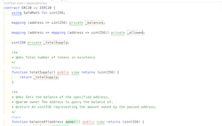

# Free TON Solidity Visual Developer

[Marketplace](https://marketplace.visualstudio.com/items?itemName=alexbassss.free-ton-solidity-visual-developer)

* Advanced Free TON Solidity Language Support
* Code Augmentation
* Source Exploration

Free TON Solidity Visual Developer is the [Solidity Visual Developer](https://github.com/ConsenSys/vscode-solidity-auditor) clone.
It's use Base Grammar for Solidity: [vscode-solidity](https://github.com/juanfranblanco/vscode-solidity).

This extension contributes semantic highlighting, a detailed class outline, advanced Free TON Solidity code insights to Visual Studio Code.

You can customize this extension for your needs! Show/Hide/Enable/Disable features in `preferences → Settings → Solidity Visual Developer: solidity-va.*`

Because our solution is the [Solidity Visual Developer](https://github.com/ConsenSys/vscode-solidity-auditor) clone, you can also get all feauteres of this solution. 
See details description on their github.

# Installation

**Method 1:** Install by going to [Visual Studio Market Place](https://marketplace.visualstudio.com/items?itemName=alexbassss.free-ton-solidity-visual-developer) and click  `Install`. 

**Method 2:** Bring up the Extension view in VS Code and search for  `Free Ton Solidity Visual Developer` and click `Install`

## Features

Semantic highlighting and solidity insights for passive security awareness. Most features are configurable (`preferences -> Settings -> Solidity Visual Developer`)

##### Themes (`preferences -> Color Theme`):

* Visual Auditor Dark - based on the "Atom One" theme
* Visual Auditor Light (Visual Studio) - based on the standard "light (VSCode)" theme
* Visual Auditor Solarized Light - based on the standard "Solarized Light" theme

##### Syntax Highlighting

* access modifiers (`external`, `public`, `payable`, ...)
* security relevant built-ins, globals, methods and user/miner-tainted information (`address.call()`, `tx.origin`, `msg.data`, `block.*`, `now`) 
* storage access modifiers (`memory`, `storage`)
* developer notes in comments (`TODO`, `FIXME`, `HACK`, ...)
* custom function modifiers 
* contract creation / event invocations
* easily differentiate between arithmetics vs. logical operations
* make Constructor and Fallback function more prominent

##### Semantic Highlighting

* highlights StateVars (constant, inherited)
* detects and alerts about StateVar shadowing
* highlights function arguments in the function body

##### Review Features

* audit annotations/bookmarks - `@audit - <msg>` `@audit-ok - <msg>` (see below)
* generic interface for importing external scanner results - cdili json format (see below)

##### Views

* Cockpit View
  * Explor and focus on solidity files in your workspace
  * Generate report/graphs for any files/folders selected in the explorer views
  * Selectively flatten files
  * Search for contracts that are likely to be deployed in the system
  * Context-sensitive views: click into a contract in the editor to list public state-changing method
  * Get quick access to extension settings
* Outline View
  * populates VS Code outline view with sourceUnit and contract layout
  * contracts, stateVars, methods, inherited names
  * annotates security relevant information (visibility, ...)
  * calculates complexity rating
  * annotations functions with information about whether they are accessing stateVars

